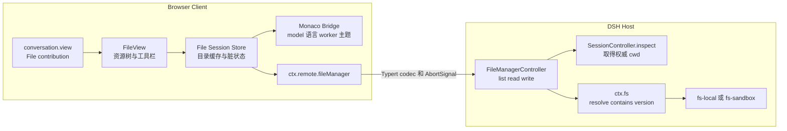

# DSH File Manager 插件实现方案

> 状态：V1 已实现并通过仓库级验证  
> 参考项目：`../dsh-embedded-codex` 及其固定的 DSH upstream  
> 目标布局：`Chat | File | 轨迹`

## 结论

建议把当前仓库实现为一个同时包含 Host 与 Client 的外部 DSH 插件：

- Client 通过 `conversation.view` 插槽注册第三个 `File` 视图，不修改 `ui-conversation` 核心代码。
- File 使用稳定 id `file`、`order: 5`。现有 Chat 为 `0`、轨迹为 `10`，最终顺序即 `Chat | File | 轨迹`。
- Host 根据 `sessionId` 取得 Session 的权威 `cwd`，只允许访问该目录及其子目录。
- Monaco Editor 负责文本查看、编辑和语法高亮；V1 只处理完整 UTF-8 文本文件。
- 保存必须携带读取时取得的版本令牌，文件被外部修改后拒绝静默覆盖。
- Monaco、语言模块和 worker 随插件一起交付，不依赖 CDN。

这套方案与 DSH 当前的扩展方式一致，也保留了后续加入多文件页签、搜索、创建和删除等能力的空间。

## V1 范围

### 包含

- 在会话标题栏增加 `File` tab，并按 Session 记住当前选中的顶层视图。
- 左侧工作区文件树，目录按需展开，支持刷新和隐藏文件开关。
- 右侧单一活动文件编辑器。
- 文本查看、编辑、撤销和重做。
- 根据扩展名进行语法高亮，未知类型使用纯文本。
- `Cmd+S` 或 `Ctrl+S` 保存。
- 未保存状态、保存中状态、保存失败和外部修改冲突提示。
- 明暗主题、中文和英文文案、响应式布局及基础键盘可访问性。
- 切换到 Chat 或轨迹后再返回时，保留当前文件和未保存内容。

### 延后

- 新建、删除、重命名和移动文件或目录。
- File 视图内部的多文件编辑页签。
- 图片、PDF、音视频和其他二进制预览。
- 全局搜索替换、快速打开和最近文件。
- LSP、跳转定义、引用查找和代码补全增强。
- Git diff、提交、历史与三方冲突合并。
- Session 工作区之外的任意目录浏览。

V1 保持单一活动文件，可以避免在顶层 `File` tab 内再引入一套复杂 tab 生命周期。Store 和 Monaco model URI 仍按可扩展方式设计，后续加入多文件不会改变 Host API。

## 从参考项目得到的实现约束

### 外部插件工程方式

`dsh-embedded-codex` 中复用构建、验证和 Bundle/Profile 开发方式：

- 固定 `upstream/deepseek-harness` 提交，保证构建可复现。
- 使用相同的 Host/Client face、Typert 和 `clientBundle` 构建契约。
- 发布前执行 `pnpm pack` 白名单与归档结构验证。
- 日常开发把两个 bundle 链接到 Embedded Codex 的同一个隔离 Web profile。

Embedded Codex 的 `cordis.patch.yml` 会禁用并替换多个版本相关 provider。File Manager
不替换任何 provider，但仍通过自己的 `dsh.bundle.patch` 暴露一个只有 `insert` 的
`cordis.patch.yml`，让 `dsh plugin add` 能自动把它加入目标 profile。

这是一层 Cordis 组合配置，不是对 DSH TypeScript/JavaScript 源码的 patch。它只插入
`id: file-manager`、`name: dsh-file-manager` 的普通插件 row；Host 与 Client face 仍由
DSH 标准 loader 加载。

当前固定的 DSH CLI 会在安装后识别 `dsh.bundle.patch`，将
`dsh-file-manager` 加入 `dsh.profile.bundles`。用户无需手工复制 row；profile 自己的
`cordis.patch.yml` 只用于覆盖 File Manager 配置。

### 会话视图插槽

DSH 当前并没有把 Chat 和轨迹写死在标题栏中：

- `ui-chat/src/client/apply.ts` 注册 `conversation.view`，id 为 `chat`，order 为 `0`。
- `ui-trajectory/src/client/index.ts` 注册同一个 slot，id 为 `trajectory`，order 为 `10`。
- `ui-conversation` 遍历这个 slot 生成 tab，并按 Session 保存当前视图。

因此 File 应采用同一模式：

```ts
const NS = 'file-manager'

ctx.slots.inject('conversation.view', () => ctx.slots.register({
  name: 'conversation.view',
  id: 'file',
  order: 5,
  locale: NS,
  label: () => t('view.file'),
  inject: (sessionId: SessionId) => createFileViewInjected(ctx, sessionId),
}, FileView))
```

这样会直接继承现有 tab 的视觉样式、ARIA 语义、切换行为和 HMR 清理机制。

## 界面方案

```text
┌──────────────────────────────────────────────────────────────────────────┐
│  Chat                File                轨迹                             │
│                      ━━━                                                 │
├──────────────────────────────────────────────────────────────────────────┤
│  workspace / src / client                         [显示隐藏] [刷新] [保存] │
├───────────────────────┬──────────────────────────────────────────────────┤
│ 文件资源管理器         │ FileView.tsx  ●                                  │
│                       ├──────────────────────────────────────────────────┤
│ ▾ src                 │                                                  │
│   ▾ client            │              Monaco Editor                       │
│     ▸ components      │                                                  │
│       FileView.tsx    │                                                  │
│       index.ts        │                                                  │
│   ▸ host              │                                                  │
│ package.json          │                                                  │
├───────────────────────┴──────────────────────────────────────────────────┤
│ 工作区根目录已锁定                         TypeScript  UTF-8  Ln 5, Col 7 │
└──────────────────────────────────────────────────────────────────────────┘
```

### 布局与行为

- 资源树默认宽度建议为 `280px`，允许拖动，限制在 `220px` 到 `420px`。
- 面包屑只显示 Session 根目录内的相对路径，不向浏览器暴露 Host 绝对根路径。
- 目录首次展开时调用 `list`；刷新只使目标目录缓存失效，不递归扫描整个仓库。
- 单击文本文件后调用 `read`，创建或替换 Monaco model。
- 当前文件变脏时在文件名后显示圆点，并启用保存按钮。
- 选择其他文件时，如果当前文件未保存，则提供“保存并打开”“放弃并打开”“取消”。
- 切换 Chat、File、轨迹不会丢掉 File 的编辑缓冲区。
- 现有共享 Composer 继续可用；FileView 需要为底部 Composer 浮层预留空间。
- 窄屏下资源树变成可开合侧栏，优先保证编辑器宽度。

### 可访问性

- 资源树使用 `role="tree"`、`treeitem` 和正确的 `aria-expanded`。
- 支持方向键、Enter、Home、End 和左右键展开收起。
- 保存、刷新、隐藏文件等图标按钮均提供可本地化的可访问名称。
- 视图重新激活后恢复到上次聚焦的树节点或编辑位置。

## 系统架构



### 组件职责

| 组件 | 负责 | 不负责 |
| --- | --- | --- |
| `FileView` | 布局、资源树、工具栏、空状态和错误呈现 | 不直接访问文件系统 |
| `FileSessionStore` | 目录缓存、活动文件、脏状态、请求取消和冲突状态 | 不解析版本令牌 |
| `MonacoBridge` | editor、model、语言、主题、快捷键和 worker 生命周期 | 不判断远程权限 |
| `FileManagerController` | Remote 参数验证、Session 根目录绑定、读取和保存编排 | 不信任浏览器提供的 `cwd` |
| `ctx.fs` | 路径解析、canonical containment、元数据、受限读取和原子写入 | 不管理 UI 状态 |

## Host Remote API

Remote 命名空间建议为 `ctx.remote.fileManager`，使用 `TypertRemoteService` 和生成的 Host、Client codec。

### list

```ts
interface ListRequest {
  sessionId: SessionId
  /** 相对 Session cwd；空字符串表示根目录 */
  path: string
  showHidden?: boolean
}

interface ListResponse {
  path: string
  entries: FileEntry[]
  truncated: boolean
}

interface FileEntry {
  name: string
  path: string
  kind: 'file' | 'directory' | 'other'
  size?: number
  version?: string
  symlink?: boolean
}
```

行为：

- 只列出一层直接子项。
- Host 限制单次返回的最大条目数。
- Client 将目录排在文件前，再按名称显示。
- 根外链接不返回为可进入的目录。

### read

```ts
interface ReadRequest {
  sessionId: SessionId
  path: string
}

interface ReadResponse {
  path: string
  content: string
  version: string
  size: number
}
```

行为：

- 只返回完整的有效 UTF-8 文本，不返回截断内容。
- 二进制、特殊文件或超限文件直接返回稳定错误。
- `version` 是不透明令牌，Client 只能原样保存并在写入时回传。
- 高亮语言由 Client 根据规范化相对路径和扩展名推断。

### write

```ts
interface WriteRequest {
  sessionId: SessionId
  path: string
  content: string
  expectedVersion: string
}

interface WriteResponse {
  path: string
  version: string
  size: number
}
```

行为：

- V1 只更新读取过的既有普通文件。
- 强制使用 `replaceIfVersion`，不暴露无条件覆盖入口。
- 成功后返回新版本，Client 更新基线并清除脏状态。
- `content` 同样受 `maxFileBytes` 限制。

## 工作区安全

浏览器只提供 `sessionId` 和相对路径。每个 `list`、`read`、`write` 都在 Host 重新执行以下校验：

1. 校验 `sessionId` 和路径形状，拒绝绝对路径、NUL、空路径段和任何 `..` 穿越。
2. 调用 `SessionController.inspect(sessionId, signal)`，取得 Session 元数据中的权威 `cwd`。
3. 解析 `cwd` 得到 root；根路径请求直接使用 root，其余路径以 root 为 cwd 调用 `ctx.fs.resolve`。
4. 使用 `ctx.fs.contains(root, target)` 校验 canonical containment。
5. 列目录时校验每个返回项的 target；通过 `lstat` 标记链接，过滤指向根外的链接。
6. 读取使用 `readBytes(target, signal, maxFileBytes)` 的硬上限，再进行 fatal UTF-8 解码和 NUL 样本检查。
7. 写入调用 `writeText`，携带 `replaceIfVersion` 和显式 `workspace-write` policy。

`fs-sandbox` 主要约束文件变更，File Manager 自己仍必须对读取执行根目录 containment，不能把读取安全寄托在 mutation sandbox 上。

### 稳定错误码

| Remote code | 场景 | Client 行为 |
| --- | --- | --- |
| `file-manager/no-workspace` | Session 不存在或没有有效 `cwd` | 显示无可用工作区 |
| `file-manager/outside-workspace` | 绝对路径、穿越或链接逃逸 | 拒绝操作并保留当前视图 |
| `file-manager/not-found` | 文件被删除或目录变化 | 刷新父目录并提示 |
| `file-manager/not-text` | NUL 样本或无效 UTF-8 | 显示不可预览状态 |
| `file-manager/too-large` | 超过读取或写入上限 | 显示文件大小和上限 |
| `file-manager/stale-version` | 保存前文件被外部修改 | 保留本地内容并进入冲突状态 |
| `gateway/cancelled` | 用户切换文件或 Session 被销毁 | 静默结束过期 loading |
| `file-manager/io` | 权限或未知 I/O 错误 | 显示可重试错误和简洁诊断 |

## 保存一致性

```text
read(path)  -> content + version V1
用户编辑    -> Monaco model dirty = true
write(path, content, expectedVersion = V1)
  成功       -> version V2，更新保存基线，dirty = false
  stale      -> 保留本地 content，禁止自动覆盖
```

V1 冲突处理：

- 不自动重试，不使用 last-write-wins。
- 保留用户当前缓冲区。
- 显示“磁盘文件已变化”。
- 提供“重新载入磁盘版本”和“取消”两个操作。
- V1 不提供“强制覆盖”；用户可以先复制本地内容再重新载入。

这套失败关闭策略可以避免编辑器在外部工具、Git 操作或 Agent 修改文件后静默覆盖新内容。

## Client 状态模型

每个 Session 拥有独立的 `FileSessionStore`，生命周期由 `uiSession` provider 或等价的 Session binding 持有，而不是放在 `FileView` 的临时组件 state 中。

```ts
interface FileSessionSnapshot {
  rootPhase: 'idle' | 'loading' | 'ready' | 'error'
  directories: ReadonlyMap<string, DirectoryState>
  expandedPaths: ReadonlySet<string>
  selectedPath?: string

  activePath?: string
  activeVersion?: string
  activeSize?: number
  editorPhase: 'empty' | 'loading' | 'clean' | 'dirty' | 'saving' | 'conflict' | 'error'

  treeWidth: number
  showHidden: boolean
}
```

关键规则：

- 目录缓存以规范化相对路径为 key。
- 每次文件或目录请求都持有 `AbortController`；新请求会取消旧请求。
- 过期响应带 generation id，不能覆盖当前选择。
- 顶层 tab 切换不销毁 store；Monaco model 可安全重建，并恢复缓冲区、光标、选区与滚动位置。
- Session 删除或插件热卸载时，统一取消请求并释放全部资源。

## Monaco 集成

### API 与 model

- 直接使用 `monaco-editor` API，不额外引入 React wrapper。
- model URI 使用自定义 scheme，例如：

  ```text
  dsh-file:///<encoded-session-id>/<encoded-relative-path>
  ```

- V1 同一 Session 只保留一个活动 model；切换文件前完成脏状态决策。
- 使用 `ResizeObserver` 调用 `editor.layout()`；视图重新激活后重新测量。
- 组件卸载时保存 view state 并 dispose editor/model；Session binding 销毁时取消目录、读取与写入请求。

### 语言支持

第一版建议注册以下常见语言：

- TypeScript、JavaScript 和 JSX/TSX
- JSON、JSONC
- HTML、CSS、SCSS
- Markdown
- YAML
- Shell
- Python
- 未知扩展名回退到 plaintext

不启动工作区级 LSP；TypeScript/JavaScript、JSON、HTML 和 CSS 系列启用 Monaco
自带 worker 语言服务，其余语言提供高亮、括号匹配、缩进和基础编辑能力。

### 主题

- 订阅 `ctx.theme` 的 `theme/change`。
- 根据 `snapshot.active.colorScheme` 切换 `dsh-light` 和 `dsh-dark`。
- 从 DSH `--dsw-alias-*` token 映射编辑器背景、文本、边框、选中、警告和错误色。
- FileView 自身只使用 DSH token，不重新定义顶层 tab 样式。

### Worker 与打包

DSH Client Modules 以插件的 `lib/client.js` 作为页面资产参与组合，不能假设 bundler 额外产生的 worker chunk 会被自动服务。因此：

- 构建输出必须包含一个可独立加载的 `lib/client.js`。
- Monaco editor worker 在构建期转成源码字符串或 inline worker。
- `MonacoEnvironment.getWorker` 通过 Blob URL 创建 worker。
- 插件销毁时 revoke Blob URL。
- 不使用 CDN，也不在运行时下载语言资源。
- CI 记录 `client.js` 原始和 gzip 大小，并对体积增量做审查。
- pack 冒烟测试检查没有运行时必需但未发布的 chunk。

## 建议配置

配置进入 Cordis Config schema，并在 Host inspection 中可见。

| 配置项 | 建议默认值 | 说明 |
| --- | ---: | --- |
| `maxFileBytes` | `2 MiB` | 限制读取和保存内容，Host 强制执行 |
| `maxEntriesPerDirectory` | `2000` | 限制单次目录结果，超出时返回 `truncated` |
| `showHiddenByDefault` | `false` | 默认隐藏点文件，用户可切换 |
| `editable` | `true` | 部署可切换为只读查看模式 |

## 工程结构

建议保留一个 npm package，但明确分离 Host、Client 和共享类型三个 face。

```text
dsh-file-manager/
├── package.json
├── pnpm-workspace.yaml
├── tsdown.config.ts
├── src/
│   ├── index.ts                  # Host FileManagerController
│   ├── types.ts                  # Browser-safe Remote DTO
│   ├── host/
│   │   └── operations.ts         # 工作区约束、读取和条件写入
│   └── client/
│       ├── index.ts              # locale theme slot 与 Session source
│       ├── FileView.tsx          # 组合视图
│       ├── file-store.ts         # 每 Session 状态机
│       ├── Explorer.tsx          # 懒加载资源树
│       ├── MonacoEditor.tsx      # editor model worker 生命周期
│       ├── monaco-runtime.ts     # 精选语言与语言服务入口
│       ├── monaco-assets.ts      # 内联 CSS 与 Blob worker 生命周期
│       ├── language.ts           # 扩展名到 Monaco language
│       ├── locales.ts            # zh 与 en
│       └── styles.module.css     # DSH token 驱动样式
├── tests/
│   ├── host-operations.spec.ts
│   ├── client-model.spec.ts
│   ├── client-state.spec.ts
│   └── package-contract.spec.ts
├── scripts/
│   ├── build.mts
│   └── verify-package.mts
└── upstream/deepseek-harness     # 固定提交的 submodule
```

### 包导出

```json
{
  "exports": {
    ".": "./lib/index.js",
    "./client": "./lib/client.js",
    "./types": "./lib/types/types.js",
    "./typert": "./lib/typert.host.js",
    "./remote": "./lib/typert.remote-client.js"
  }
}
```

实际 `package.json` 已提供对应的 `types` 条件、files 白名单与 `dsh.client` 注入信息。

### 关键依赖

| Face | 依赖或 peer | 用途 |
| --- | --- | --- |
| Host | Cordis、`dsh-fs`、`dsh-api-session-controller`、`dsh-typert-protocol` | 文件能力、Session 根目录和 Remote |
| Client | api gateway、connection、ui renderer、ui conversation、ui session、locale、theme | 插槽、状态、RPC、主题与文案 |
| Editor | `monaco-editor` | 查看、编辑与语法高亮 |

Client feature 之间只通过服务边界协作；需要类型时使用 type-only import，避免产生不受控的运行时跨包依赖。

## 实现状态

### 阶段一 插件骨架（完成）

- 固定 DSH upstream。
- 建立 package exports、双 face 构建和 Typert 生成。
- 通过目标 DSH 产品已有的插件装配入口加载该包，不修改上游源码，也不引入兼容 patch。
- 构建脚本校验 upstream commit 和无 patch 契约。

交付结果：Host/Client 双 face、Typert Remote 与单文件 Client bundle 已生成。

### 阶段二 Host 文件能力（完成）

- 定义共享 DTO 和稳定错误码。
- 实现 `list`、`read`、`write`。
- 完成 Session 根目录绑定、路径 containment、文件限制和版本保护。
- 先补齐 Host 单元测试与组合测试。

交付结果：`list`、`read`、`write` 及路径、符号链接、UTF-8、大小、取消和版本保护测试通过。

### 阶段三 File 视图（完成）

- 注册 `conversation.view`，确认顺序为 `Chat | File | 轨迹`。
- 建立每 Session store。
- 实现资源树、面包屑、刷新、隐藏文件、空状态和错误状态。
- 验证顶层 tab 与 Session 切换后的状态恢复。

交付结果：`order: 5` 的 File tab、懒加载资源树、错误状态与 Session 状态恢复已实现。

### 阶段四 Monaco 编辑（完成）

- 接入 Monaco editor 与活动 model。
- 完成语言映射、明暗主题、快捷保存和 dirty 状态。
- 完成 stale-version 冲突处理。
- 完成 worker 内联与 bundle 体积检查。

交付结果：编辑、快捷保存、冲突保护、主题和无 CDN 的内联 worker 已实现。

### 阶段五 收尾验收（完成）

- 完成响应式、键盘操作和 ARIA。
- 验证 Composer 与 Monaco 焦点、快捷键不会冲突。
- 完成 HMR、Session 销毁和资源释放测试。
- 使用 `pnpm pack` 检查发布白名单、必需产物、脚本语法和无额外 runtime chunk。

真实 Web profile 通过本包的 `dsh.bundle.patch` 自动取得 composition row；接入产品后
只需完成一次人工明暗主题与目标尺寸视觉验收。

## 测试计划

| 层级 | 必须覆盖 | 通过标准 |
| --- | --- | --- |
| Host 单元 | 绝对路径、`..`、symlink 逃逸、二进制、超限、取消、stale save | 根外内容从未返回或写入，错误码稳定 |
| Client Store | 懒加载、请求抢占、dirty 保留、Session 隔离、冲突与 reload | 过期响应不覆盖当前状态 |
| Client | slot 注册、tab 顺序、请求抢占、dirty、冲突、状态恢复、dispose | 过期响应不覆盖当前状态，资源可释放 |
| 契约 | 加法型 Bundle patch、Session 寻址和 Host 权威根目录 | manifest 与源码契约稳定 |
| 打包 | 单一 `client.js`、离线 worker、无本机绝对路径、pack 白名单 | 发布归档不存在缺失或隐藏 runtime chunk |
| 产品验收 | 目标产品的真实 Loader、1024/1440、明暗主题 | 加入普通 row 后完成一次浏览、编辑、冲突和视觉检查 |

## 完成定义

- 会话标题栏显示 Chat、File、轨迹，File 的选中状态按 Session 恢复。
- 用户可展开目录、打开常见文本文件并获得正确高亮。
- 用户可编辑并使用 `Cmd+S` 或 `Ctrl+S` 保存。
- 外部修改不会被静默覆盖。
- 二进制、超限、权限和路径错误都有可理解的 UI。
- 任何 API 输入都无法访问 Session `cwd` 之外的路径，包括 symlink 逃逸。
- 切换 Session 或热卸载后没有悬挂请求、重复 slot、未释放 Monaco model 或 worker URL。
- pack 后归档包含完整 Host、Client、Typert、类型、许可证和内联编辑器资源。

## 已采用的 V1 决策

| 决策 | 当前建议 | 调整影响 |
| --- | --- | --- |
| File tab 位置 | Chat 与轨迹之间，`order: 5` | 其他位置只需调整 order |
| 活动编辑器 | V1 单一活动文件 | 多文件页签会增加 model、关闭确认和恢复逻辑 |
| 写能力 | V1 只编辑既有文本文件 | 新建、删除和重命名需要额外权限、确认与 fs 能力 |
| 工作区边界 | 严格等于 Session `cwd` | 允许上级目录会改变安全模型，不建议 |
| 文件上限 | 默认 `2 MiB`，可配置 | 提高会增加传输、内存和 Monaco 响应风险 |
| 标签文案 | 中文“文件”，英文“File” | locale 可调整，不影响稳定 id `file` |

这些决策已经落实到实现与测试中。后续扩展多文件页签或创建、删除、重命名时，需先扩展
权限和冲突模型，不应复用当前只替换既有文件的写入口。
